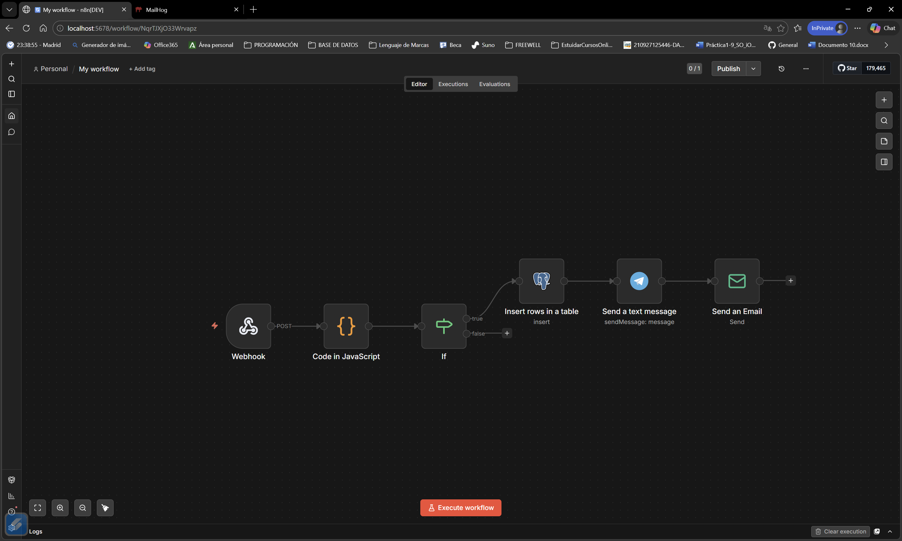

# Práctica n8n: WAF - Detección de Inyección SQL (SQLi)

## Flujo de trabajo de N8N



## 1. Descripción del incidente que se detecta
Este flujo actúa como un WAF (Web Application Firewall) básico, diseñado para detectar y mitigar **intentos de Inyección SQL (SQLi)** en tiempo real. Analiza los datos de entrada (payloads) enviados a través de formularios web simulados (como inicios de sesión o cajas de búsqueda) en busca de comandos maliciosos comunes. El objetivo es prevenir que un atacante extraiga información o modifique la base de datos subyacente de la aplicación.

## 2. Explicación de la lógica de detección
El flujo se activa mediante un **Webhook** que recibe peticiones `POST` simulando el tráfico web (IP, usuario y payload). A continuación, la lógica se desarrolla en dos pasos:
1. **Nodo Code (JavaScript):** Normaliza el payload convirtiéndolo a minúsculas, usando `toLowerCase()`, para asegurar que el análisis sea insensible a mayúsculas/minúsculas y evitar técnicas de evasión.
2. **Nodo IF (Evaluación Lógica):** Utiliza código JavaScript nativo y expresiones regulares (`.test()`) para inspeccionar el payload normalizado. Busca palabras clave críticas de SQL, independientemente del texto que las rodee: `{{ /union|select|insert|update|delete|drop/.test($json.body.payload) }}`. 
   * Si detecta estos comandos (rama `True`), clasifica el tráfico como un ataque.
   * Si no los detecta (rama `False`), asume que es tráfico legítimo y detiene el análisis.

## 3. Justificación de los criterios utilizados
Se ha optado por este escenario y lógica de detección por varias razones:
* **Realismo:** La inyección SQL sigue siendo una de las vulnerabilidades más críticas y comunes (OWASP Top 10).
* **Precisión:** El uso de expresiones regulares combinadas con la normalización del texto en el nodo `Code` proporciona un método robusto para detectar múltiples variantes de un mismo ataque sin generar falsos positivos en el tráfico normal.
* **Respuesta Proporcional Multicanal:** Se implementa una respuesta técnica completa. Primero, **persistencia forense** guardando la evidencia del ataque (IP, usuario, payload) en una tabla específica (`sqli_incidents`) de PostgreSQL. Posteriormente, se escala el incidente con **dos alertas simultáneas**: un correo electrónico al equipo SOC vía Mailhog y un mensaje instantáneo de Telegram al administrador, garantizando una notificación inmediata del incidente crítico.

## 4. Preparación del Entorno (Base de Datos)
Antes de ejecutar el flujo por primera vez, es necesario crear la tabla donde se almacenarán los incidentes. Para ello, con los contenedores de Docker en ejecución, se debe ejecutar el siguiente comando en la terminal para acceder a PostgreSQL y crear la estructura necesaria:

```bash
docker exec -it postgres psql -U n8n_user -d n8n_db
```

**Una vez dentro de la consola de PostgreSQL, ejecutar la siguiente sentencia SQL:**
```SQL
CREATE TABLE sqli_incidents (
    id SERIAL PRIMARY KEY,
    timestamp TIMESTAMP DEFAULT CURRENT_TIMESTAMP,
    source_ip VARCHAR(50),
    username_attempt VARCHAR(100),
    malicious_payload TEXT
);
```

## 5. Configuración de Credenciales
Para que el flujo funcione tras la importación, se deben configurar las siguientes credenciales:
* **PostgreSQL:** Host `postgres`, Base de datos `n8n_db`, usuario `n8n_user`, contraseña `n8n_pass`, Puerto `5432`.
* **Telegram:** API Token obtenido de @BotFather y tu ChatID obtenido @RawDataBot.
* **SMTP (Mailhog):** Host `mailhog`, Puerto `1025`, sin autenticación.

## 6. Instrucciones para probar el workflow
Para probar el correcto funcionamiento del workflow, se deben realizar las pruebas detalladas en el archivo adjunto `Payloads_Ejemplo.txt` utilizando herramientas como Postman, enviando peticiones `POST` a la URL del Webhook de prueba de n8n.

**Nota sobre URLs de Webhook:**
* **URL de Producción:** `http://localhost:5678/webhook/login-check`. El flujo ha sido activado para funcionar permanentemente en esta URL. Las ejecuciones pueden consultarse en el historial (Executions) de n8n.
* **URL de Test:** `http://localhost:5678/webhook-test/login-check`. Usar esta URL si se desea ver la ejecución en tiempo real desde el editor de n8n activando el botón "Listen for Test Event".

**Ejemplos de Prueba Positiva (Simulación de Ataque):**
1. Activar "Listen for Test Event" en el Webhook de n8n.
2. Enviar la siguiente petición `POST` en formato JSON:

**1. Ataque de SQL Injection (UNION-Based) - DEBE SER BLOQUEADO**
   ```json
   {
     "ip": "192.168.1.55",
     "username": "admin",
     "payload": "admin UNION SELECT * FROM passwords"
   }
```

**2. Ataque de destrucción (SQLi DROP) - DEBE SER BLOQUEAD**
   ```json
   {
     "ip": "198.51.100.7",
     "username": "admin",
     "payload": "'; DROP TABLE clientes;--"
   }
```

**Ejemplos de Prueba Negativa (Simulación de JSON permitido):**
1. Activar "Listen for Test Event" en el Webhook de n8n.
2. Enviar la siguiente petición `POST` en formato JSON:

**3. Tráfico Legítimo - NO DEBE SER BLOQUEADO**
   ```json
   {
     "ip": "192.168.1.100",
     "username": "jefe_ventas",
     "payload": "Hola, necesito acceso al panel de ventas de este mes. ¡Gracias!"
   }
```

## 7. Reflexión sobre posibles mejoras
* **Refinamiento de la lógica para reducir Falsos Positivos:** La expresión regular actual es muy agresiva y podría bloquear conversaciones legítimas sobre bases de datos. Una mejora sería refinar la Regex para que solo salte si las palabras clave van acompañadas de sintaxis SQL real (como comillas `'`, guiones `--` o punto y coma `;`).
* **Implementación de Mitigación Activa:** El flujo actual es reactivo (avisa y registra). Una mejora clave sería añadir un nodo que conecte con la API de un Firewall (como Cloudflare o IPTables) para banear automáticamente la dirección IP de origen tras detectar el primer intento de ataque.
* **Enriquecimiento de Alertas:** Integrar un nodo que consulte APIs de reputación de IPs (como AbuseIPDB o VirusTotal) para adjuntar al mensaje de Telegram información sobre si la IP atacante ya ha sido reportada previamente por otros incidentes.
* **Persistencia Avanzada:** En lugar de una tabla simple, se podría implementar un sistema de rotado de logs o exportar los datos a un SIEM (Security Information and Event Management) para un análisis de tendencias a largo plazo.